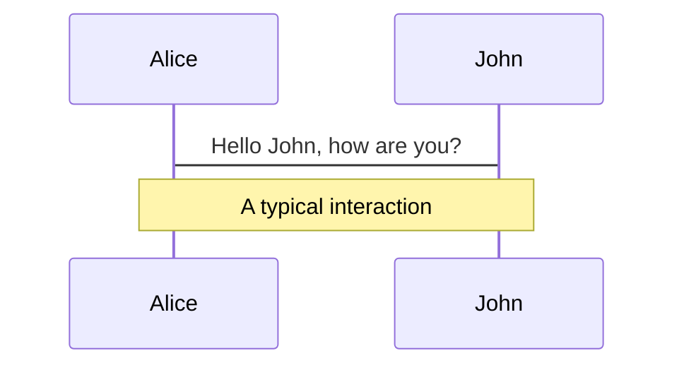
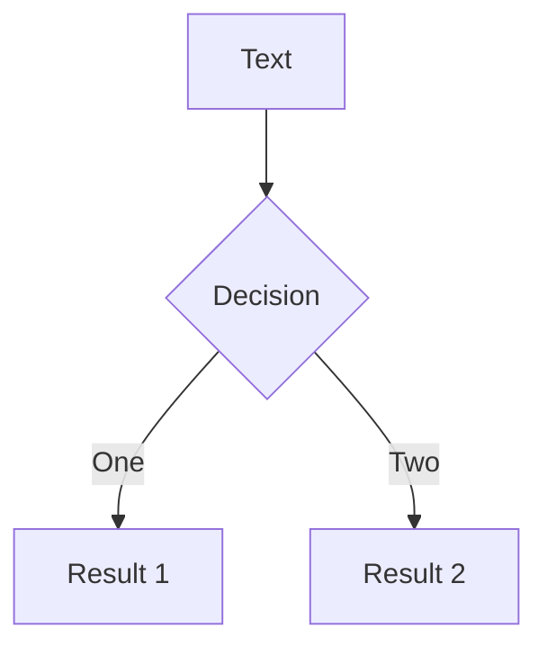
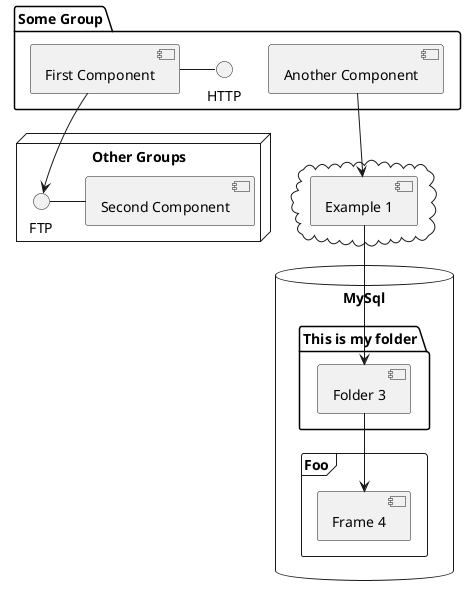

---
# try also 'default' to start simple
theme: seriph
# random image from a curated Unsplash collection by Anthony
# like them? see https://unsplash.com/collections/94734566/slidev
background: https://source.unsplash.com/collection/94734566/1920x1080
# apply any windi css classes to the current slide
class: 'text-center'
# https://sli.dev/custom/highlighters.html
highlighter: shiki
# show line numbers in code blocks
lineNumbers: false
# some information about the slides, markdown enabled
info: |
  ## Slidev Starter Template
  Presentation slides for developers.

  Learn more at [Sli.dev](https://sli.dev)
# persist drawings in exports and build
drawings:
  persist: false
# use UnoCSS
css: unocss
---

# Welcome to Slidev

Presentation slides for developers

<div class="pt-12">
  <span @click="$slidev.nav.next" class="px-2 py-1 rounded cursor-pointer" hover="bg-white bg-opacity-10">
    Press Space for next page <carbon:arrow-right class="inline"/>
  </span>
</div>

<div class="abs-br m-6 flex gap-2">
  <button @click="$slidev.nav.openInEditor()" title="Open in Editor" class="text-xl icon-btn opacity-50 !border-none !hover:text-white">
    <carbon:edit />
  </button>
  <a href="https://github.com/slidevjs/slidev" target="_blank" alt="GitHub"
    class="text-xl icon-btn opacity-50 !border-none !hover:text-white">
    <carbon-logo-github />
  </a>
</div>

<!--
The last comment block of each slide will be treated as slide notes. It will be visible and editable in Presenter Mode along with the slide. [Read more in the docs](https://sli.dev/guide/syntax.html#notes)
-->

---

# 伪球迷观世界杯

&emsp;&emsp;“20多个人踢来踢去，半天都进不了一个球有什么意思，也不知道有什么好看的！”。
这个是我在2018年俄罗斯世界杯之前对足球这项运动的评价，但也是这届世界杯开始我渐渐找到了其中的趣味。

&emsp;&emsp;对于这种球类运动或者说大点这些体育运动，最都是在体育课里开始接触的，什么乒乓球、羽毛球、篮球、排球、足球，这些球类运动都玩过也都会一点。但最后选择了篮球作为了长期爱好，因为玩篮球的人比较多，场地也比较多，下课放学都能玩儿（真实原因：感觉打篮球帅，利于吸引异性眼光）。打篮球是初中开始打的，但那会儿就是纯瞎打，基本功运球投篮都没好好练，也不在乎输赢就图个和好朋友们一起玩儿。直到上了高中，经常在球场看到学校里一些打球打得很好的打球，惊叹于他们的球技的同时感觉自己还是太菜了。于是那会儿就开始了精进自己的球技之旅，看视频回放，什么过人教学视频、艾佛森的CrossOver、克劳福德背后运球、NBA的比赛，当然其中也穿插了在学校球场的”实践“。渐渐的也算是入门了篮球这项运动，成为了一位篮球伪球迷。我之所以称自己为伪球迷是因为我没有自己的主队，也没有最喜爱的球员，属于爱得广泛。我喜欢科比的坚毅、麦迪的飘逸、欧文的丝滑、詹姆斯的霸气等等球员，我喜欢听解说们解说比赛，了解这些球员们背后的故事。到这里你或许觉得我有些偏题了，但我想说的就是体育运动都是想通的，只是规则和玩法的不同罢了，这会儿让我们回到脚下，回到世界杯吧。

&emsp;&emsp;2018年世界杯是我第一次认真的看足球比赛，因为当时下铺的大学室友非常喜欢，我坐他旁边一起看了一场法国VS阿根廷的那场1/8决赛，好家伙一场比赛进了7个球，因为一直都有进攻和防守反击，中间穿插着7次进球，这场比赛成了我完整看完的第一场足球比赛。那场比赛除了超级巨星梅西以外，法国小将姆巴佩一站成名，我相信他让我们所有观众都记住了他的名字，他在这场球赛中给球迷观众们展现了惊人的个人能力。查阅那场比赛的记录后，让我们回溯到2018的俄罗斯世界杯的绿茵场上，在比赛10分钟时，姆巴佩从中场断球，以蛮不讲理的带球速度长驱直入，连过四人突袭至阿根廷禁区，后者无奈之下只能在禁区放倒姆巴佩，主裁判判罚点球，随后格利茨曼主罚命中，法国队先得一分。这场比赛推翻了以前脑中足球运动就是一个球在中场来来回回的概念，让我眼前一亮，有种高手过招，神仙打架的感觉。在直播解说的战术分析以及我下铺兄弟一边看球一边给我科普足球知识的情景下，我从那场比赛中找到了足球的乐趣，因为能看懂比赛了，就好比小时候看父母打麻将不会超过三分钟（因为完全看不懂，哈哈哈），即便超过三分钟那也是在边上想着如何搞点零花钱和楼下等着我的好兄弟去游戏厅大杀四方。

&emsp;&emsp;到现在，四年过去了，也毕业了，又是一届世界杯开打了，这次虽没有了下铺的兄弟一起看球，但是我已经能自己看懂比赛获得观赛的快乐了。这几年里也看了不少足球比赛，积累了一些喜欢的球员以及他们成名之路上的一些坎坷故事，虽然这些和球赛看似没有关系，但我认为那是足球比赛的一部分，因为这些故事能让我们知道他们是如何一步步走到世界杯绿茵场上，让我更加了解喜欢的球员。

这里我和大家分享三位我比较喜欢的球员的故事吧。
<br/>

### 第一位：巴西舞者 内马尔


<br>
<br>


<!--
You can have `style` tag in markdown to override the style for the current page.
Learn more: https://sli.dev/guide/syntax#embedded-styles
-->

<style>
h1 {
  background-color: #2B90B6;
  background-image: linear-gradient(45deg, #4EC5D4 10%, #146b8c 20%);
  background-size: 100%;
  -webkit-background-clip: text;
  -moz-background-clip: text;
  -webkit-text-fill-color: transparent;
  -moz-text-fill-color: transparent;
}
</style>

<!--
Here is another comment.
-->

---

# Navigation

Hover on the bottom-left corner to see the navigation's controls panel, [learn more](https://sli.dev/guide/navigation.html)

### Keyboard Shortcuts

|     |     |
| --- | --- |
| <kbd>right</kbd> / <kbd>space</kbd>| next animation or slide |
| <kbd>left</kbd>  / <kbd>shift</kbd><kbd>space</kbd> | previous animation or slide |
| <kbd>up</kbd> | previous slide |
| <kbd>down</kbd> | next slide |

<!-- https://sli.dev/guide/animations.html#click-animations -->

<p v-after class="absolute bottom-23 left-45 opacity-30 transform -rotate-10">Here!</p>

---
layout: image-right
image: https://source.unsplash.com/collection/94734566/1920x1080
---

# Code

Use code snippets and get the highlighting directly![^1]

```ts {all|2|1-6|9|all}
interface User {
  id: number
  firstName: string
  lastName: string
  role: string
}

function updateUser(id: number, update: User) {
  const user = getUser(id)
  const newUser = { ...user, ...update }
  saveUser(id, newUser)
}
```

<arrow v-click="3" x1="400" y1="420" x2="230" y2="330" color="#564" width="3" arrowSize="1" />

[^1]: [Learn More](https://sli.dev/guide/syntax.html#line-highlighting)

<style>
.footnotes-sep {
  @apply mt-20 opacity-10;
}
.footnotes {
  @apply text-sm opacity-75;
}
.footnote-backref {
  display: none;
}
</style>

---

# Components

<div grid="~ cols-2 gap-4">
<div>

You can use Vue components directly inside your slides.

We have provided a few built-in components like `<Tweet/>` and `<Youtube/>` that you can use directly. And adding your custom components is also super easy.

```html
<Counter :count="10" />
```

<!-- ./components/Counter.vue -->
<Counter :count="10" m="t-4" />

Check out [the guides](https://sli.dev/builtin/components.html) for more.

</div>
<div>

```html
<Tweet id="1390115482657726468" />
```

<Tweet id="1390115482657726468" scale="0.65" />

</div>
</div>

<!--
Presenter note with **bold**, *italic*, and ~~striked~~ text.

Also, HTML elements are valid:
<div class="flex w-full">
  <span style="flex-grow: 1;">Left content</span>
  <span>Right content</span>
</div>
-->


---
class: px-20
---

# Themes

Slidev comes with powerful theming support. Themes can provide styles, layouts, components, or even configurations for tools. Switching between themes by just **one edit** in your frontmatter:

<div grid="~ cols-2 gap-2" m="-t-2">

```yaml
---
theme: default
---
```

```yaml
---
theme: seriph
---
```


</div>

Read more about [How to use a theme](https://sli.dev/themes/use.html) and
check out the [Awesome Themes Gallery](https://sli.dev/themes/gallery.html).

---
preload: false
---

# Animations

Animations are powered by [@vueuse/motion](https://motion.vueuse.org/).

```html
<div
  v-motion
  :initial="{ x: -80 }"
  :enter="{ x: 0 }">
  Slidev
</div>
```

<div class="w-60 relative mt-6">
  <div class="relative w-40 h-40">
    
    
    
  </div>

  <div
    class="text-5xl absolute top-14 left-40 text-[#2B90B6] -z-1"
    v-motion
    :initial="{ x: -80, opacity: 0}"
    :enter="{ x: 0, opacity: 1, transition: { delay: 2000, duration: 1000 } }">
    Slidev
  </div>
</div>

<!-- vue script setup scripts can be directly used in markdown, and will only affects current page -->
<script setup lang="ts">
const final = {
  x: 0,
  y: 0,
  rotate: 0,
  scale: 1,
  transition: {
    type: 'spring',
    damping: 10,
    stiffness: 20,
    mass: 2
  }
}
</script>

<div
  v-motion
  :initial="{ x:35, y: 40, opacity: 0}"
  :enter="{ y: 0, opacity: 1, transition: { delay: 3500 } }">

[Learn More](https://sli.dev/guide/animations.html#motion)

</div>

---

# LaTeX

LaTeX is supported out-of-box powered by [KaTeX](https://katex.org/).

<br>

Inline $\sqrt{3x-1}+(1+x)^2$

Block
$$
\begin{array}{c}

\nabla \times \vec{\mathbf{B}} -\, \frac1c\, \frac{\partial\vec{\mathbf{E}}}{\partial t} &
= \frac{4\pi}{c}\vec{\mathbf{j}}    \nabla \cdot \vec{\mathbf{E}} & = 4 \pi \rho \\

\nabla \times \vec{\mathbf{E}}\, +\, \frac1c\, \frac{\partial\vec{\mathbf{B}}}{\partial t} & = \vec{\mathbf{0}} \\

\nabla \cdot \vec{\mathbf{B}} & = 0

\end{array}
$$

<br>

[Learn more](https://sli.dev/guide/syntax#latex)

---

# Diagrams

You can create diagrams / graphs from textual descriptions, directly in your Markdown.

<div class="grid grid-cols-3 gap-10 pt-4 -mb-6">







</div>

[Learn More](https://sli.dev/guide/syntax.html#diagrams)

---
src: ./pages/multiple-entries.md
hide: false
---

---
layout: center
class: text-center
---

# Learn More

[Documentations](https://sli.dev) · [GitHub](https://github.com/slidevjs/slidev) · [Showcases](https://sli.dev/showcases.html)
